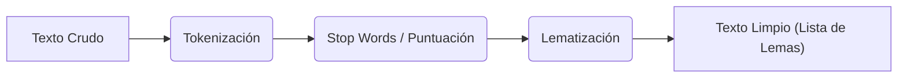
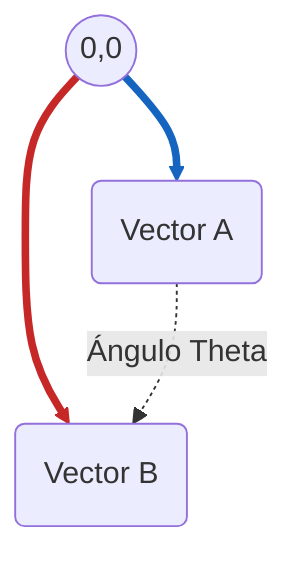
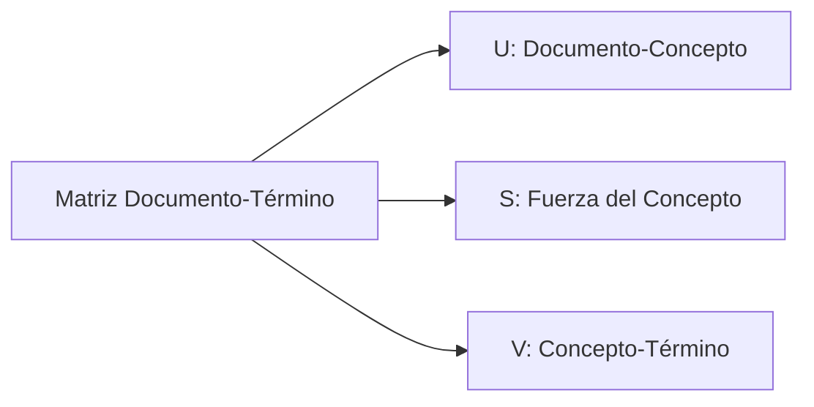
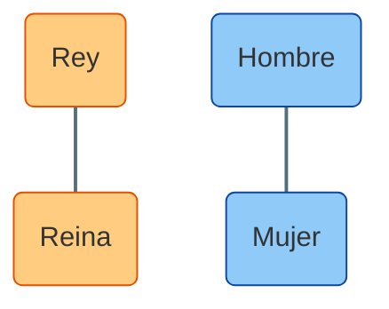

# Introducción al Procesamiento de Lenguaje Natural (NLP)

Este documento sirve como guía teórica para la clase práctica de NLP. Cubriremos los conceptos fundamentales necesarios para entender cómo las computadoras procesan y "entienden" el texto, basándonos en el flujo de trabajo visto en `practica_2_v2.py`.

## 1. Preprocesamiento de Texto con SpaCy

Antes de que un algoritmo pueda trabajar con texto, este debe ser limpiado y estructurado. Usamos la librería **SpaCy** para esto.

### Conceptos Clave:
*   **Tokenización**: Dividir el texto en unidades más pequeñas llamadas *tokens* (palabras, signos de puntuación).
*   **Lematización (`lemma_`)**: Reducir una palabra a su forma base o raíz (ej: "corriendo" -> "correr", "estudiando" -> "estudiar"). Esto ayuda a agrupar diferentes formas de la misma palabra. A diferencia de **stemming**, la lematización tiene en cuenta el significado semántico de las palabras.
*   **Part-of-Speech (POS) Tagging (`pos_`)**: Identificar la categoría gramatical de cada token (sustantivo, verbo, adjetivo, etc.).
*   **Stop Words**: Palabras muy comunes (como "el", "de", "y") que generalmente no aportan mucho significado semántico para el análisis de temas y se suelen eliminar. ¿Cuando sería
útil eliminar stop words y cuando no? (Pista: cuando se quiera analizar temas, eliminar stop words es útil, para modelos modernos como GPT no es tan relevante)

**Ejemplo de flujo:**


**Ejemplo en Código:**
```python
import spacy
nlp = spacy.load("es_core_news_sm")
doc = nlp("Los gatos están corriendo")
# Lematización: gato, estar, correr
print([token.lemma_ for token in doc]) 
```

### Extra: Reconocimiento de Entidades Nombradas (NER)
SpaCy también puede identificar entidades del mundo real como personas, organizaciones o países.

**Ejemplo:**
"Apple está buscando comprar una startup en el Reino Unido por mil millones de dólares."

*   **Apple**: ORG (Organización)
*   **Reino Unido**: GPE (Geopolítico)
*   **mil millones de dólares**: MONEY (Dinero)

**Ejemplo en Código:**
```python
import spacy

# Cargar el modelo en español
nlp = spacy.load("es_core_news_sm")

texto = "Hola, soy Ana García. Compré una Dell XPS en Falabella Santiago el viernes pasado por 1200 dólares."
doc = nlp(texto)

# Imprimir las entidades detectadas y su etiqueta
print(f"{'TEXTO':<15} | {'ETIQUETA':<10} | {'EXPLICACIÓN'}")
print("-" * 45)

for ent in doc.ents:
    # ent.text es la palabra, ent.label_ es la categoría
    # spacy.explain te dice qué significa la etiqueta (ej: ORG -> Companies, agencies...)
    print(f"{ent.text:<15} | {ent.label_:<10} | {spacy.explain(ent.label_)}")
```
**Enrutamiento inteligente**: Si detectas ORG: Falabella y LOC: Santiago, rediriges al ticket al departamento de ventas.

> [!IMPORTANT]
> Los modelos pre-entrenados no son perfectos. Es probable que "Dell XPS" lo marque a veces como Organización y no como Producto. En la industria, a menudo se hace un "fine-tuning" (reentrenamiento) para que reconozca los productos específicos de tu empresa.

> [!TIP]
> **Aplicación Real**: NER se usa para extraer información automática de noticias, clasificar tickets de soporte o anonimizar documentos legales.

## 2. Vectorización: De Palabras a Números

Los modelos de Machine Learning no entienden texto, solo números. La vectorización es el proceso de convertir texto en representaciones numéricas.

### Bag of Words (BoW) - `CountVectorizer`
Representa un documento contando la frecuencia de cada palabra.

| Documento | "gato" | "perro" | "corre" |
| :--- | :---: | :---: | :---: |
| Doc 1 | 1 | 0 | 1 |
| Doc 2 | 0 | 1 | 1 |

*   **Ventaja**: Simple de entender.
*   **Desventaja**: No captura el contexto ni la importancia relativa de las palabras.

**Ejemplo en Código:**
```python
from sklearn.feature_extraction.text import CountVectorizer
corpus = ["el gato corre", "el perro corre"]
vectorizer = CountVectorizer()
X = vectorizer.fit_transform(corpus)
print(X.toarray()) # [[1, 1, 0], [1, 0, 1]] (orden alfabético: corre, gato, perro)
```

> [!TIP]
> **Aplicación Real**: BoW se usa para clasificar documentos, detectar spam o para la búsqueda de texto.

> [!IMPORTANT]
> **Limitaciones**: No captura el contexto ni la importancia relativa de las palabras. Por ejemplo, "gato" y "perro" son tratados de manera similar, aunque su significado es diferente.

### N-Grams: El contexto importa
A veces una sola palabra no basta. "Nueva York" no es lo mismo que "Nueva" y "York" por separado.
*   **Unigramas (1-gram)**: "el", "gato", "corre"
*   **Bigramas (2-gram)**: "el gato", "gato corre"
*   **Trigramas (3-gram)**: "el gato corre"

Podemos configurar `CountVectorizer(ngram_range=(1, 2))` para capturar pares de palabras.

**Ejemplo en Código:**
```python
from sklearn.feature_extraction.text import CountVectorizer
corpus = ["el gato corre"]
# ngram_range=(1, 2) captura unigramas y bigramas
vectorizer = CountVectorizer(ngram_range=(1, 2))
X = vectorizer.fit_transform(corpus)
print(vectorizer.get_feature_names_out())
# Salida: ['corre', 'el', 'el gato', 'gato', 'gato corre']
```

> [!TIP]
> **Aplicación Real**: Los N-grams son vitales para la predicción de texto (autocompletar) y para detectar frases hechas o nombres compuestos.

### TF-IDF (Term Frequency - Inverse Document Frequency) - `TfidfVectorizer`
Mejora el BoW ajustando el peso de las palabras.
*   **TF (Frecuencia de Término)**: Cuántas veces aparece la palabra en el documento actual.
*   **IDF (Frecuencia Inversa de Documento)**: Penaliza las palabras que aparecen en *muchos* documentos (son menos informativas).
*   **Resultado**: Las palabras que son frecuentes en un documento pero raras en el resto del corpus tienen mayor peso (son más distintivas).

**Ejemplo en Código:**
```python
from sklearn.feature_extraction.text import TfidfVectorizer
corpus = [
    "el gato corre",
    "el perro corre",
    "el gato duerme"
]
tfidf = TfidfVectorizer()
X = tfidf.fit_transform(corpus)
# Palabras comunes como "el" tendrán pesos bajos (IDF bajo)
# Palabras únicas como "duerme" tendrán pesos altos
print(tfidf.get_feature_names_out())
print(X.toarray())
```

## 3. Similitud Coseno

Una vez que tenemos vectores numéricos, ¿cómo medimos qué tan parecidos son dos textos?
Usamos la **Similitud Coseno**, que mide el ángulo entre dos vectores.



*   **1.0**: Los vectores son idénticos (ángulo 0°).
*   **0.0**: Los vectores son ortogonales (no tienen nada en común, ángulo 90°).

**Ejemplo en Código:**
```python
from sklearn.metrics.pairwise import cosine_similarity
# Similitud entre Doc 1 y Doc 2 del ejemplo anterior
sim = cosine_similarity(X[0], X[1])
print(f"Similitud: {sim[0][0]:.2f}")
```

> [!TIP]
> **Aplicación Real**: Motores de recomendación (Netflix recomendando películas por descripción), detección de plagio y búsqueda semántica.

> [!IMPORTANT]
> **Por qué no calcular la distancia Euclideana**: La distancia Euclideana mide la distancia entre dos puntos en un espacio. En el caso de los vectores, la distancia Euclideana mide la distancia entre dos puntos en un espacio. Sin embargo, en el caso de los vectores, la distancia Euclideana no es una medida de similitud, sino de distancia.

## 4. Reducción de Dimensionalidad: LSA (Latent Semantic Analysis)

Cuando tenemos miles de palabras, nuestros vectores son enormes y dispersos. LSA usa una técnica matemática llamada **SVD (Singular Value Decomposition)** para reducir estas dimensiones.
*   **Objetivo**: Encontrar "conceptos" o temas latentes que agrupen palabras relacionadas.
*   **Resultado**: Podemos representar documentos complejos con solo unos pocos números (componentes) que representan temas abstractos.



**Ejemplo en Código:**
```python
from sklearn.decomposition import TruncatedSVD
# Supongamos que X es nuestra matriz TF-IDF
lsa = TruncatedSVD(n_components=2) # Reducir a 2 conceptos latentes
X_lsa = lsa.fit_transform(X)
print(f"Dimensiones originales: {X.shape}")
print(f"Dimensiones reducidas: {X_lsa.shape}")
```

## 5. Word Embeddings (Incrustaciones de Palabras)

A diferencia de BoW o TF-IDF que tratan las palabras como unidades discretas, los embeddings capturan el **significado semántico**.
*   Las palabras se representan como vectores densos en un espacio multidimensional.
*   **Propiedad mágica**: Palabras con significados similares están cerca en este espacio.
*   **Analogías**: Permiten operaciones matemáticas como `Rey - Hombre + Mujer ≈ Reina`.

**Visualización Conceptual:**


En la práctica, usamos modelos pre-entrenados de SpaCy (como `es_core_news_md`) que ya "saben" qué palabras se parecen entre sí.

**Ejemplo en Código:**
```python
import spacy
nlp = spacy.load("es_core_news_md")
token = nlp("gato")
print(token.vector[:5]) # Muestra los primeros 5 números del vector
```

### Embeddings de Documentos (Promedio)
¿Cómo representamos una frase entera con embeddings? Una estrategia simple es promediar los vectores de todas sus palabras.
`Vector("El gato corre") = (Vector("El") + Vector("gato") + Vector("corre")) / 3`

> [!TIP]
> **Aplicación Real**: Chatbots avanzados, traducción automática (Google Translate) y análisis de sentimientos profundo.

---
**Resumen del Flujo de Trabajo:**
1.  **Limpiar** el texto (SpaCy).
2.  **Convertir** a números (TF-IDF).
3.  **Comparar** documentos (Similitud Coseno).
4.  **Simplificar** la información (LSA).
5.  **Entender** el significado profundo (Embeddings).
